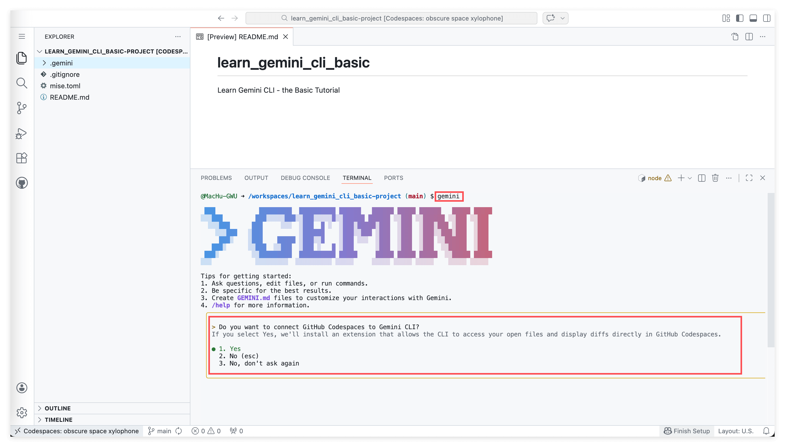
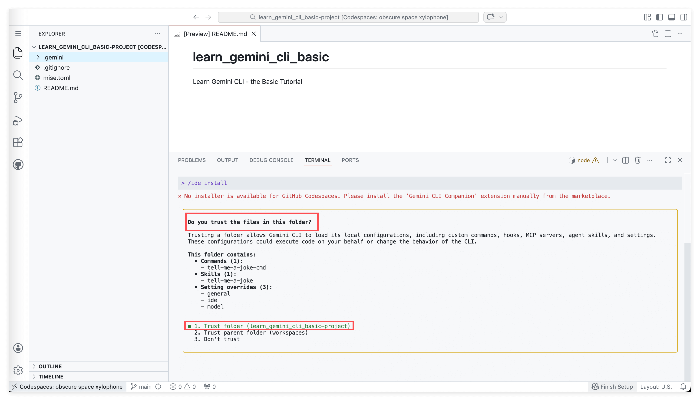
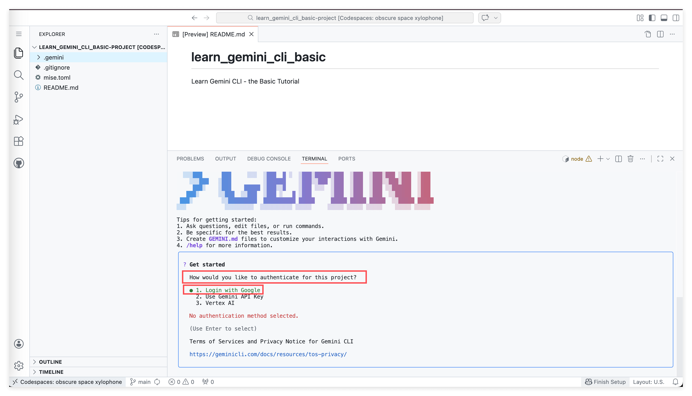
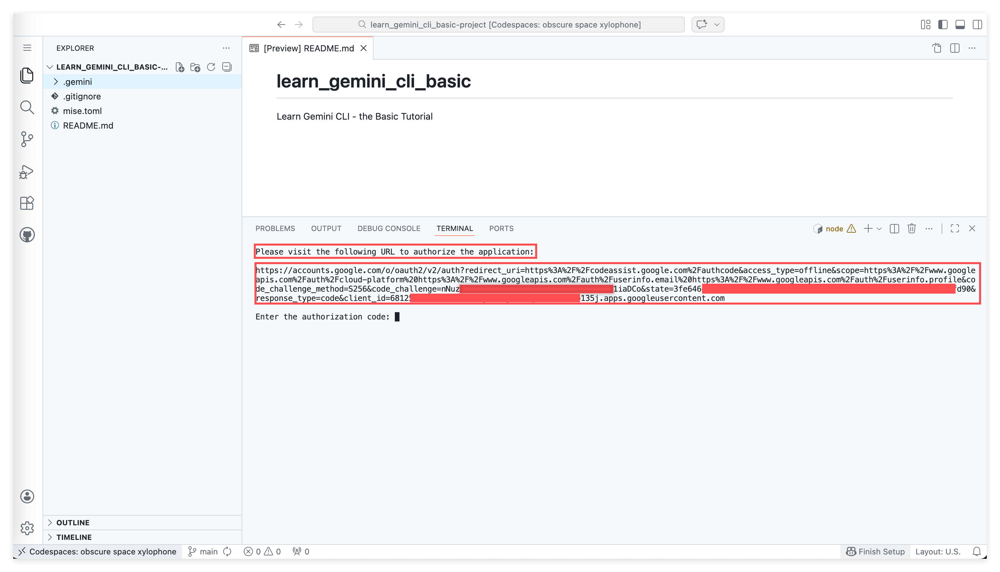
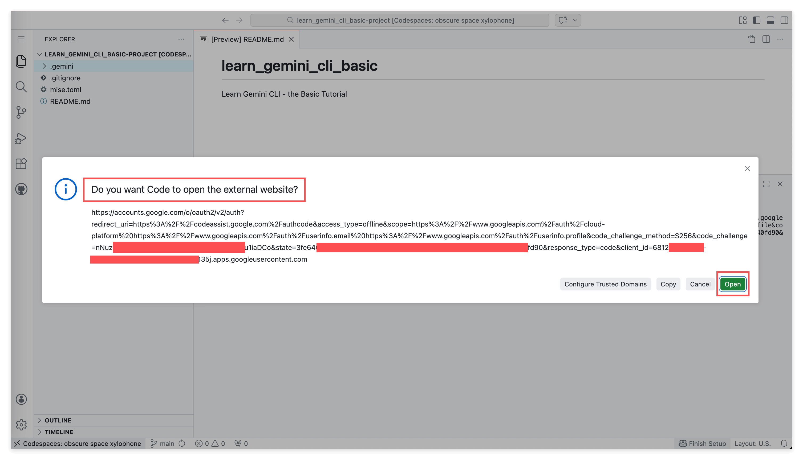
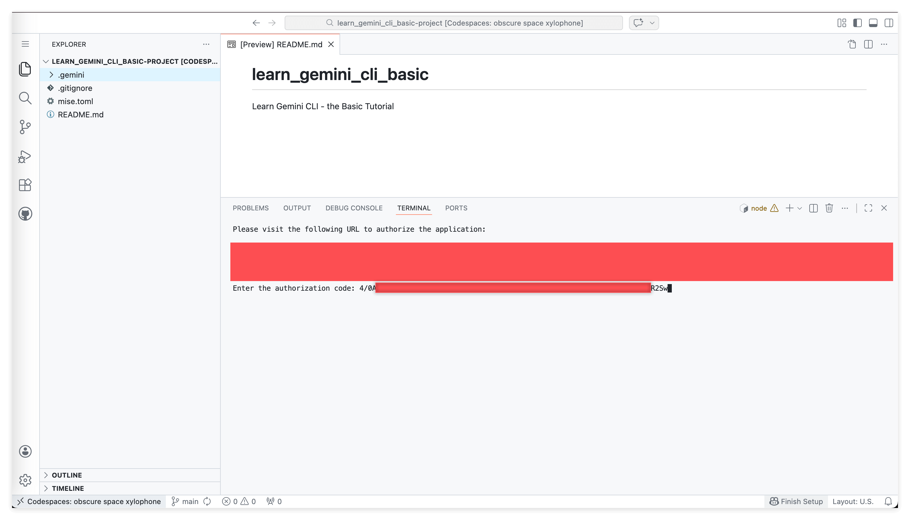
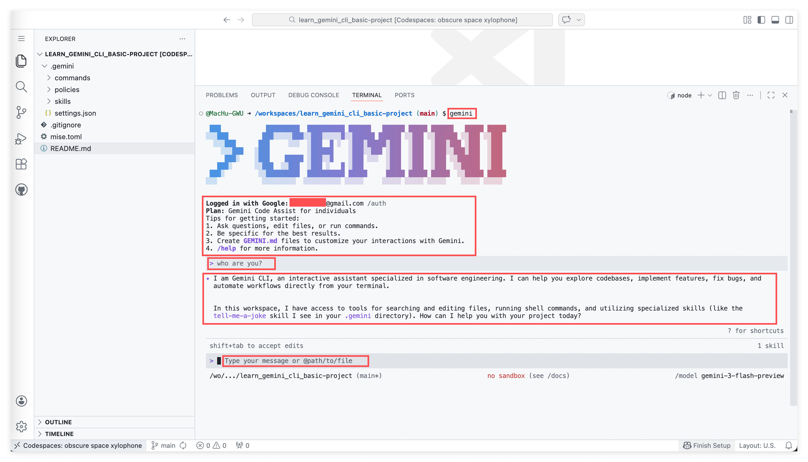

# Gemini CLI 登录指南：连接你的 AI 编程助手

## 📋 本节目标

- 理解 Gemini CLI 的三种登录方式（Google 登录、API Key、Vertex AI）
- 在 GitHub Codespaces 环境中完成完整的 Google OAuth 登录流程
- 初步了解 OAuth 授权和 Folder Trust 的基本概念

## 🎯 为什么要学这个？

想象一下：你有一个超级厉害的 AI 编程助手，它能帮你写代码、debug、探索整个代码库。但问题是——你怎么证明"你是你"，让它知道你有权使用它？

这就是登录要解决的问题。

好消息是：Gemini CLI 提供了**免费额度**（Gemini Code Assist for individuals），任何有 Google 账号的人都能使用，不需要绑信用卡。无论你是在自己的电脑上，还是在 GitHub Codespaces 这样的云端环境里，你都能成功登录并使用它。

今天我们要学的，就是如何在 Codespaces 环境下顺利"接通"你的 Gemini CLI。

## 📝 前置知识提示

本教程假设：

- 你已经安装好了 Gemini CLI（在 Terminal 中输入 `` gemini `` 命令不会报错）
- 你拥有一个 Google 账号（免费的 Gmail 账号就行，不需要付费订阅）
- 你知道如何打开 Terminal（终端/命令行）

---

## 📖 登录流程详解

### 第一步：启动 Gemini CLI 并处理初始提示

在 Terminal 中输入 `` gemini `` 并按回车，你会看到一个酷炫的 GEMINI ASCII 艺术 Logo，还有一些使用提示。



首先，Gemini CLI 会问你：**"Do you want to connect GitHub Codespaces to Gemini CLI?"**（你想把 GitHub Codespaces 和 Gemini CLI 连接起来吗？）这个提示是要安装一个 VS Code 扩展，让 CLI 能访问你打开的文件、在 Codespaces 中直接显示代码差异。

```
> Do you want to connect GitHub Codespaces to Gemini CLI?
If you select Yes, we'll install an extension that allows the CLI to access your
open files and display diffs directly in GitHub Codespaces.

● 1. Yes
  2. No (esc)
  3. No, don't ask again
```

选择 **Yes** 然后按回车。你可能会看到一条消息说 "No installer is available for GitHub Codespaces..."——没关系，继续往下走就好。

接下来，你会看到 **"Do you trust the files in this folder?"**（你信任这个文件夹里的文件吗？）的提示：



```
Do you trust the files in this folder?

Trusting a folder allows Gemini CLI to load its local configurations, including
custom commands, hooks, MCP servers, agent skills, and settings.
These configurations could execute code on your behalf or change the behavior of the CLI.

This folder contains:
  • Commands (1): tell-me-a-joke-cmd
  • Skills (1): tell-me-a-joke
  • Setting overrides (3): general, ide, model

● 1. Trust folder (learn_gemini_cli_basic-project)
  2. Trust parent folder (workspaces)
  3. Don't trust
```

这是什么意思呢？项目文件夹里可能有一些配置文件（比如自定义命令、skills、hooks、MCP servers 等），Gemini CLI 会加载并执行它们。这个提示就是在问你："这些配置是安全的吗？你确定要加载它们吗？"

选择 **1. Trust folder** 然后按回车。这告诉 Gemini CLI 可以安全地加载这个项目的本地配置。

> **重点**：Folder Trust 机制是一个安全特性。它防止恶意的项目配置在你打开文件夹时自动运行。在信任一个文件夹之前，最好先看看里面有什么。

---

### 第二步：选择登录方式

处理完信任提示后，Gemini CLI 会问你：**"How would you like to authenticate for this project?"**（你想用什么方式来认证？）



```
? Get started

How would you like to authenticate for this project?

● 1. Login with Google
  2. Use Gemini API Key
  3. Vertex AI

No authentication method selected.

(Use Enter to select)

Terms of Services and Privacy Notice for Gemini CLI
https://geminicli.com/docs/resources/tos-privacy/
```

这里有三个选项：

**选项 1：Login with Google** 用你的 Google 账号通过 OAuth 登录。这是最简单的方式，而且支持免费额度（Gemini Code Assist for individuals）。**绝大多数学员应该选这个。**

**选项 2：Use Gemini API Key** 给开发者用的，需要去 Google AI Studio 手动生成一个 API Key。

**选项 3：Vertex AI** 给企业用户用的，需要在 Google Cloud Platform 项目中配置。

选择 **1. Login with Google** 然后按回车。

> **小贴士**：选项下方有一个 Terms of Services 的链接，第一次使用的时候建议看一看。红色的 "No authentication method selected." 只是一个状态提示，选好之后就会消失。

---

### 第三步：完成 Google OAuth 授权

选择 "Login with Google" 后，Terminal 会显示一个很长的 Google OAuth URL，以及一个输入提示：



```
Please visit the following URL to authorize the application:

https://accounts.google.com/o/oauth2/v2/auth?redirect_uri=...&scope=...&client_id=...（一长串 URL）

Enter the authorization code:
```

**如果你在 VS Code 的 Codespaces 中**，可能会弹出一个对话框问你 **"Do you want Code to open the external website?"**——这是 VS Code 检测到了 Terminal 里的 URL，问你要不要打开它。



点击 **Open** 就可以在浏览器中打开授权页面。（你也可以点击 **Copy** 按钮复制 URL，然后手动粘贴到任意浏览器中打开。）

在浏览器中，Google 会让你登录（如果还没登录的话），然后问你是否同意给 Gemini CLI 授权。确认无误后，点击 **Allow** 或 **Continue**。

授权成功后，Google 会给你一个 **authorization code**（授权码）——一串以 `` 4/0A... `` 开头的很长的字符串。

**复制这个授权码**，然后回到 Terminal，在 `` Enter the authorization code: `` 后面粘贴，按回车。



> **注意**：授权码是一次性的，只有几分钟的有效期，过期了重新运行 `` gemini `` 再走一遍流程就好。

---

### 第四步：验证 AI 是否正常工作

登录成功后，你会看到 Gemini CLI 的主界面，显示：

- **Logged in with Google:** 你的邮箱地址
- **Plan:** Gemini Code Assist for individuals
- 使用提示（Tips for getting started）
- 底部有一个输入框，前面有个 `` > `` 符号



现在来测试一下你的 AI 助手是否已经就绪。在底部的输入框中输入：

```
who are you?
```

按回车后，Gemini CLI 会回复类似这样的内容：

```
I am Gemini CLI, an interactive assistant specialized in software engineering.
I can help you explore codebases, implement features, fix bugs, and automate
workflows directly from your terminal.

In this workspace, I have access to tools for searching and editing files,
running shell commands, and utilizing specialized skills (like the tell-me-a-joke
skill I see in your .gemini directory). How can I help you with your project today?
```

看到这个回复，说明你的 AI 编程助手已经成功上线了！**恭喜你，可以开始用 Gemini CLI 了！**

注意看底部的状态栏：它显示了你的项目路径、sandbox 模式、以及当前使用的模型（比如 `` gemini-3-flash-preview ``）。Gemini CLI 已经识别了你项目里的 `` .gemini `` 文件夹和里面的内容。

---

## 🔑 简单理解：OAuth 是什么？

你可能好奇：为什么登录这么"绕"？为什么不能直接输入用户名密码？

这里涉及到一个叫 **OAuth** 的安全机制。用一个生活化的比喻来解释：

想象你住在一个高档小区（你的 Google 账号）。现在有一个外卖员（Gemini CLI）要给你送餐。

- **传统方式**：你把家门钥匙复印一把给外卖员。危险！万一钥匙丢了呢？
- **OAuth 方式**：外卖员到小区门口，保安（Google 授权系统）打电话问你"有个叫 Gemini CLI 的要进来送餐，你同意吗？"你说"同意"，保安就给他开门，但不给他钥匙。

OAuth 的好处是：

- Gemini CLI 永远不会知道你的 Google 密码
- 你可以随时在 Google 账号设置中撤销授权
- 即使 Gemini CLI 有漏洞，你的 Google 账号也是安全的

你平时用"用 Google 登录"、"用微信登录"各种 App，背后都是这个原理。今天可能是你第一次亲手"走"一遍这个流程，但这个概念会陪伴你整个技术生涯。

---

## 💡 小贴士

**如果你需要重新登录**，可以在 Terminal 中运行：

```
gemini auth login
```

这会重新触发登录流程。

**如果你想查看当前的登录状态**，可以运行：

```
gemini auth status
```

---

## 👨‍🏫 导师寄语：为什么 Gemini CLI 的登录设计值得学习

你可能觉得，登录不就是登录吗？有什么值得多说的？

让我告诉你为什么这个看似简单的流程背后，藏着很深的产品设计智慧。

### 免费 AI 降低门槛

不像很多 AI 编程工具需要付费订阅，Gemini CLI 的免费额度（Gemini Code Assist for individuals）意味着任何有 Google 账号的人都能用上强大的编程助手。这是 Google 有意为之——降低 AI 辅助开发的入门门槛。

### 命令行工具的力量

很多人第一次看到 Gemini CLI 会问："为什么不做成一个漂亮的 App？"

答案是：**命令行是最通用的界面**。

无论是你的 MacBook、公司的 Linux 服务器、云端的 Codespaces、还是树莓派上的 Ubuntu——只要有 Terminal，Gemini CLI 就能运行。当你未来需要在生产服务器上调试代码、在 Docker 容器中排查问题、在 CI/CD 流水线中自动化任务时，你会感谢 Gemini CLI 选择了命令行。

### Folder Trust 背后的安全思维

"你信任这个文件夹吗？"这个提示看似多此一举，其实在教你一个重要的安全原则：**不要盲目执行来源不明的代码**。这个思维会在你整个技术生涯中受用，无论是 review 别人的 pull request、安装 npm 包、还是打开下载的项目。

### 这可能是你与 Google OAuth 的第一次"亲密接触"

今天你亲手完成了一次完整的 Google OAuth 授权流程。这个经历比看十篇文章都有价值。

因为你不再是"听说过 OAuth"，而是"用过 OAuth"。当你未来开发自己的应用、需要接入"用 Google 登录"时，你会想起今天的经历：啊，原来那个按钮背后，就是这个流程。

**恭喜你成功连接了 Gemini CLI！**

接下来，就是用它来创造价值的时候了。

---

## ✅ 完成检查清单

- [ ] 成功在 Terminal 中运行 `` gemini `` 命令，看到 GEMINI ASCII 艺术欢迎界面
- [ ] 处理了 "Connect GitHub Codespaces" 的提示
- [ ] 选择了信任项目文件夹（Trust folder）
- [ ] 选择了 "Login with Google" 作为登录方式
- [ ] 完成了 Google OAuth 授权（打开 URL、同意授权、粘贴授权码）
- [ ] 看到 "Logged in with Google" 以及你的邮箱和 Plan 信息
- [ ] 在 Gemini CLI 中输入 `` who are you? `` 并收到完整的自我介绍回复

## 💡 关键要点总结

1. **三种登录方式**：Login with Google（免费，推荐）、Gemini API Key、Vertex AI——大多数人选第一个
2. **Folder Trust**：Gemini CLI 会在加载配置前问你是否信任这个文件夹，这是安全特性，不是麻烦
3. **OAuth 的本质**：Google 充当可信中间人，Gemini CLI 获得代替你操作的权限，但不需要知道你的密码
4. **免费额度**：截至 2026 年 3 月，Gemini Code Assist for individuals 对所有 Google 账号免费开放
5. **命令行的优势**：在任何有 Terminal 的环境都能使用 Gemini CLI
